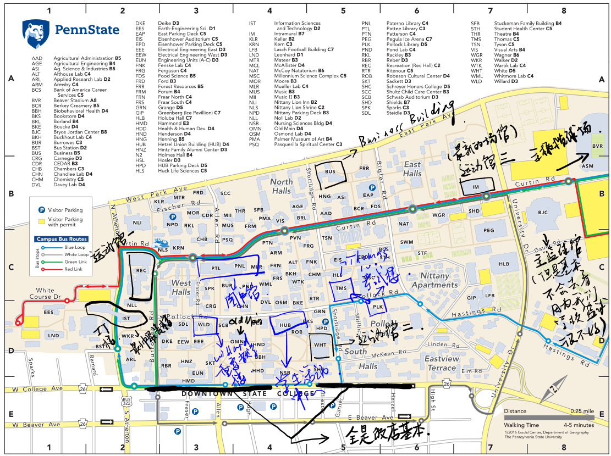
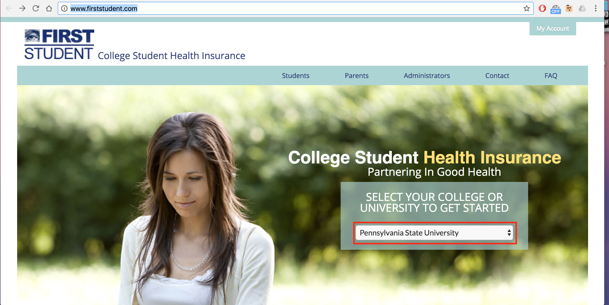

# 生活指南篇

## 保险购买指南

#### 开学第一周往往是最忙碌的。相信大家有很多事情去忙碌，但千万不要忘记购买保险。因为保险是留学生（持 F1 签证）必须要求购买的，如果不购买可能会有严重的后果。

#### 这是学校官方的保险购买通知

## 学校地图概况

**温馨提示：小编强烈建议各位在开学之前，找学姐学长带着大家认识一下校园，因为相信小编，我们大宾村的校园可不是一般大，是真的很大，未来开始的第一周上课不会迷路因此迟到的话，大家还是提早做好准备吧！大家也可以去参见学校的new student orientation, 届时也会有学校的志愿者带领大家参观校园的。问学长学姐哪家强，CUSA 呀！！！**

## 校内外公交系统分布

**美国号称车轮上的国家是绝非浪得虚名的。但是无形中有形成了，在一般城市中公交系统极度匮乏的情况。好在，在我们大宾村，我们的公交系统还是十分完善的。说到这就不得不提到我们学校的垄断公交公司（catabus）。**

* **公交线路**
  * **Centre Line**
    * 就是大体上围绕着整个Penn State 大学校园及城市的各种公交线路。常见的线路有（N, NV, W, V, NE, WE, VE, HP, B, M等）。
  * **Loop/Link**
    * Loop 包括 blue Loop 和 White Loop 是两条围绕校园且方向相反的环线。Link 包括 Green Link 和 Red Link, 是围绕校园以及 downtown 周边的一条线路。重要的是,小编要强调下这些线路都是免费的！OK！免费！free!  
* **收费形式**
  * **零钱**
    * 美国的自动售票机器非常高级，即可以投纸币，也可以投硬币。并且会自动计算金额，当达到票价时会自动 beep 一声。但是，也是恕不找零的！
  * **Token**
    * 看起来像一个金色的游戏币。可以在学校 hub 的 information center 或 downtown 的营业厅购买。20个39刀,另外也提供手机通过 Token Transit app 购买 day passes。
  * **公交卡**
    * 这种也是最常见以及最划算的一种付费方式。分为月票和季票两种形式。月票79刀，季票309刀。均可在相对应有效期内无限次乘坐制定公交车。一般在营业厅买的 bus pass 是可以乘坐所有线路的。同样，外面的一些学生公寓会发给tenants 免费或者折扣的 bus pass, 但是所能乘坐的线路有限。  
* **办公地点**
  * **Address:**
    * 108 East Beaver Avenue, State College, PA 16801-4921

      \(below the Centre Region Schlow Library\)
  * **Phone:**
    * \(814\)-238-2282
  * **Office hour:**
    * Monday – Friday:

      7:30 a.m. – 5:30 p.m.

    * Saturday:

      9:30 a.m. – 1:00 p.m.

    * Sunday:

      Closed


#### 友情提示

由于美国公交车前都会有放自行车的行李架，所以原则上说，是可以带自行车乘公车的，但是要自己抬上去。

美国公交车全部配备电子即时监控系统，可以通过catabus APP 查看即时车辆位置及信息，例如：你可以定位到你自己所在站点，查看经过车辆，预计到达时间，及晚点状况等。强烈推荐下载，耐出行之利器。

通常来讲bus 会在晚上12点左右结束运营，所以想去晚上happy的小伙伴们一定要带上有车的学长学姐一起哦！

由于，学校白天正常4点之前是不允许任何社会车辆进入的。所以，bus是最方便的一种上课选择。


## 学校附近超市及生活用品采购区域

**提到state college这座城市，大概每个penn stater都会想到“麻雀虽小，五脏俱全”这八个字。没错，虽然我们村，但我们的超市从亚洲超市到美国本土生活超市，品类之繁多也不亚于其他大城市。**



从大部分中国留学生最感兴趣的亚洲超市说起，最受欢迎的两家亚洲超市，一家叫东方超市\(yingwenming\)，另一家叫虹超市\(Far Corners\)，离downtown略远，可叫cab 或者打Uber到达~这里的供货非常全，涵盖亚洲所有热卖的零食饮品， 和朋友一起吃火锅前，最开心的事莫过于一起来东方采购佐料，火锅底和食材~



除了亚洲超市以外，另一大以卖食物为主的超市即为全美连锁的 Trader Joe's！虽然离学校很远，但是考完 midterm,打个车买些美食犒劳一下自己也是在不失为一件乐事。这里小编强推石锅拌饭！虽然速食的东西容易给人留下不好的印象，但这个用微波炉加热三分钟便能吃的石锅拌饭实在是 Trader Joe's的良心出品！吃过一次就忘不了的味道！除了石锅拌饭，微博上还有各类推荐的 Trader Joe's的明星食品大家可以自己去扒一扒。



若是你觉得 Trader Joe's太远实在不方便，Wegmans 也是买食品的圣地~乘坐V-line，cab或 Uber都能到达，距离学校车程大概10分钟左右。这里的水果塔和面包简直是小编每天心心念念的牵挂！买几份屯在冰箱里，每天都有满满的幸福感和安全感！也无疑是 final期间的最佳伴侣~相较于其他的大型超市，Trader Joe's和 Wegmans里卖的水果更新鲜。 如果是有机食物的发烧友，Trader Joe's和 Wegmans 一定是不二选择！



Walmart. 第一家便是耳熟能详的 Walmart, 乘坐 V-line可以到达。不需过多介绍，大家应该对Walmart也很熟悉。 Walmart 卖的东西相对比较便宜，而且这里生活用品，学习用品，娱乐用品应有尽有！Walmart 最大的亮点是入口处卖 pretzel 的 Auntie Annie, 小编只在 State College 见过这一家，也成了每次去 Walmart的动力~

Giant 相较于 Walmart， 价格稍稍贵了些，但是质量却比 Walmart更好，食品也更新鲜。乘坐 V-line亦可到达。

T.J.Maxx 是一家很有特色的超市，他们主打一些打折的货物，从饰品衣物到家里的装饰物都有涉猎。时不时来这里逛逛，可以淘到一些很可爱很有特色又很便宜的小东西。 另外，如果你很喜欢交换礼物趴，这里也是你来挑选礼物的好地方~



## 学校downtown周围餐厅介绍

**到了新学校，想必大家最最最最最最关心的就是吃了吧！别急，我们这就帮大家科普一下学校附近的餐厅。 Downtown 的话了算是 PSU 最繁华的一个地段了，路是窄了点，不过吃的可是很多的。 中餐的话有西安，大碗公，祥龙，唐龙，金鼎，小四川，稍微远点的有百度火锅，和 Fuji。 其它亚洲菜系有 Tadashi， Waker chicken，稍微远点的有 Kimchi，东南亚，My Thai。 美餐 Corner Room算是不错的。**

**另外，推荐给大家两个点餐神器：Ricepo 跟 one menu。上面基本集结了State College附近的所有中餐厅和奶茶店。懒癌晚期在家点外卖就好啦。**

## 宿舍指南

**PSU Park校区分为五个宿舍区，分别为Pollock, North, South, East 以及 West. 这五个区各有千秋，各有各的特色。**



Pollock 居住人口最多的宿舍区，离downtown和教学楼都很近，也是生活最方便的区。

然而最让Pollock 出彩的便是Pollock Commons—全校最好吃也是人最多的食堂。中餐，墨西哥餐，美餐还有日餐应有尽有，在 Pollock 经常可以看到一位扎着辫子艺术气息颇为浓厚的日本老爷爷做日本料理，毋庸置疑也是排队时间最长的窗口。不管你是不是住在 Pollock, 都一定要来 Pollock 的食堂慰问一下自己的胃，品尝一下老爷爷的手艺，若是meal plan用不完，还可以在 Pollock 宴请宾客。而且高大上的Pollock Building 和 testing center都在 Pollock~

想要通宵泡lab写作业的同学可是非常方便的哟~

Pollock整个地理位置在学校的中心，所以去基本上所有的教学楼都不远，也是离downtown非常的近。但住宿条件可能会相较其他几个宿舍区要差一些，跟East差不多，但娱乐设施比East多。浴室卫生间都是公共的，每层有一男一女两个，不是很方便。



North 的住宿条件是五个宿舍区中最好的，也是大多数中国人都选择主的地方，虽然相对比较偏远。North 的房型为 suite。两个人住一个房间四个人一个套间。套间里面有浴室和小客厅。也就是说四个人 share 一个浴室和小客厅。

当然 North 的价格也会比较贵一点。同时也一个学习的好地方，因为不是在学校的中心，所以相对比较安静。离 HUB 也不远，走路5分钟就到了。五个住宿区中国人最多的一个区。值得一提的是 North的设施比较新，比如说有室内停自行车的地方，洗衣机什么的也比较高端！

另外，North 距离 Sunset Park 也是步行可以到达的距离，学业不忙时饭后散步到 Sunset Park，看看日落也是很浪漫幸福的。

但如果多体验一些大学生活，Party的氛围，North这边的活动稍微偏少一些。这里的食堂吃的种类不多，离 downtown 的餐厅也比较远。North距离三个健身房比较远，但是出门就是 Blue Loop, White Loop，Red Link, Green Link。



South 除去几个新建的宿舍楼，也是比较老的宿舍区，居住条件在North 与 Pollock 之间。

新建造的几个Hall里面大部分都是住着兄弟会，姐妹会的人。其中两个是专门提供给 Honors College的同学们的。但大家可以尝试着申申看，也有少部分好运的同学被分配到里面。距离downtown奇近无比。

South的食堂应该也是位居第二，比 Pollock 更迷人的是，South 提供midnight 食堂，Commons会开到12：00。

跟north差不多的是，这里的大一新生会相对比较少。派对和各种新生的活动会相对比较少。房间内部是没有卫生间的，但楼层内都会配备单人可上锁的洗漱沐浴间，还是比较方便的。



East 的取胜点则在于离最好吃的冰淇淋点 Berkey Creamery 和最大的健身房 IM Building都很近，饭后不管是来一桶冰淇淋还是去健身房跑步都非常方便。

另一大特点就是美国人比较多！East的房型也是两人double，公共浴室。价格就是统一两人间价格2860。房间家具摆放的位置给人一种空间很大的赶脚~

非常重要的一件事情是。。。在East 的浴室洗澡像是在打脸一样，非常的痛苦！想要跟美国人玩玩的同学不妨尝试一下美丽的 East！身边会全部都是跟你一样的大一新生，比较容易能交到朋友。但离教学楼和 downtown 会比较远，还有因为大学的氛围比较浓，派对会很多，晚上会比较吵。公共卫生间，没有独立的。



West 相对于其他四个宿舍区比较清静，如果你是喜欢安静的生活远离喧闹的话，West再适合不过了。最大的优点就是他的地理位置。

West 宿舍就是离各种大一会上课的地方（Sparks, Chamber, Forum, Willard）最近的地方。你可以课间回家补觉补妆什么的，那感觉简直是要飞起哦！大概一两分钟就可以走到图书馆了哦！强烈推荐爱学习的好同学们住 West。也可以说是校园里最漂亮，最 classic 的宿舍去了，里外都非常漂亮。离各个教学楼非常近，上课很方便。同时没有很浓的派对氛围，学习氛围比较浓。相比较其他的宿舍区，West 各种设施不是那么的新。



**除此之外，学校还有其他住宿区，Pollock旁边的 Nittany Apartment，South以东的 Eastview Terrace，学校最西端的White Course……这些住宿区条件更好，价格高昂，并且不开放给一般的大一新生选择，有兴趣的同学在外来可以考虑申请。当然，学校周边也有很多住房区，但学校规定，如果没有特殊情况，主校区的freshman是必须要在学校住一年的，（土豪可以忽视这句话，自己愿意再出钱住在校外也是可以的） PSU 附近的住房区有很多。大一的小鲜肉们可以了解下，毕竟多半数学生会选择在第二年住在校外。有个自己的房子感觉还是会很棒的。当然，每个人选房的需求也是不一样的，可以找学长学姐们提前了解一下哦。**

## 保险购买指南

**开学第一周往往是最忙碌的。相信大家有很多事情去忙碌，但千万不要忘记购买保险。因为保险是留学生（持F1签证）必须要求购买的，如果不购买可能会有严重的后果。这是学校官方的保险购买通知**

**这里和大家介绍的就是如何购买学校保险：**

**第一步就是输入网址：http://www.firststudent.com/**

**进入这个页面之后输入咱们的学校 Penn State 就会跳出下一个页面http://www.firststudent.com/school_page/pennsylvania-state-university/home-pennsylvania-state-university/**

**大家进入这个页面之后点Enroll Now-Health Insurance。之后就会进入申请页面～**

**在这个页面大家需要填写自己的信息，填写完成之后就可以选择付款了。大家可以选择使用 electronic check 和信用卡付款，推荐大家使用 electronic check 付款。最后一年保险的金额应该在 $2444 左右。付完款之后就可以去打印自己的 insurance ID card 了。这样我们的保险就购买完成啦，预祝大家在 Penn State 的生活开心顺利 ☺**

## 驾照考取方式

驾照攻略

* **考前准备材料**
  * 护照
  * 打印下来的 i-94 (网站https://i94.cbp.dhs.gov/) 和i20
  * SSN卡，或者 SSN Refusal Letter
  * 两份居住证明
  * 体检证明

* **SSN或 Refusal Letter**
 * 有 SSN 的同学可以带着 SSN 卡片，但是
没有 SSN 卡的同学也仍然可以申请驾照。
没有 SSN 的同学可以去 Social Security Administration 领取 Letter of Ineligibility 来代替 SSN 卡。

* **居住证明**
  * 两份居住证明：一份住处开的居住证明（住宿舍的同学可以去 istart 上或宿舍管理处申请）和一份银行或水电公司寄来的账单（上面标注你的名字和住址）

## 考试流程

### 关于笔试

&emsp;&emsp;美国交通规则与中国交通规则有许多类似的地方。关于交通规则和试题的手册可以去dmv拿到。拿好材料就可以去dmv进行笔试了。笔试需要付约$36， 要用money order。笔试中，电脑会给你18个题目，答对15个即过关。过关后 就能得到一张learner’s permit， 即副驾驶坐着一个21岁以上有驾照的人就可以上路了
关于路考 
&emsp;&emsp;这是最关键的一步。记住你一定要预约，同时带上平时陪你练车的人与车，当然了，还要陪练人的驾驶证和车的一些证明还有保险。因为美国是希望人人都可以开车的，所以路考很简单，不会考你复杂的技术，只是看你是否掌握最基本的驾驶技能。我们这里只是让你开一小圈，看一看是否会用刹车，会加速，会用指示灯，还有就是倒车入库。提前去认一下路线很有必要。虽然美国路考对技术要求不高，但对驾驶习惯特别是细节性问题却有特别的要求：比如上车是否系安全带，发动车时是否环顾了四周，看了后置镜，转弯是否打转弯灯，见到行人是否远远就刹车…，中国人常常很容易忽视这些细节。所以经常有这样的事，在中国很会开车的人到美国路考没有通过，而在美国刚刚学车的人，自认为开得很不好却通过了路考。 
&emsp;&emsp;通过了路考，机动车辆管理部当场就给你一份驾驶执照，上面有你的名字，有你的签字，然后就可以开车上路了。当然如果你有了车，开车上路时还必须购买汽车保险。在美国，汽车没有保险是违法的。

### 路考小提示
  1. 坐上车后，先系好安全带。

  2. 考官会要求你把车钥匙转到ON，但是不启动车，检查你的刹车、转向灯、雨刷、除雾器、大灯、喇叭等。如果你的车上有的部件不能正常工作的话，考官是不会让你路考的。

  3. 路考前，把座位调大点空间，让考官坐得舒服了，考试时也会心情好些。考官坐上车后，等他发指令你再启动车。

  4. Stop sign一定要停满三秒。遇到红灯一定要停，如果你在红灯要右转，一定要先full stop了，再逐渐向前挪动车子，挑合适的机会转弯。看见行人一定要让。

  5. 过四叉路口一定要动作夸张地左右张望一下（当然也是真的要看清楚一些），不然考官会认为你没有注意路况，会扣分的。

  6. 右转时一定要以明显动作回头过肩看右后方，不然会被扣分的。

  7. 绝对不能超速，不然立马就fail了。

  8. 在自己不确定可以安全换道时，就不要勉强，考官还是要命的，不会勉强你的，最多给你换条路线。

  9. 路边停车时，如果在有坡度的路上，要注意轮子的方向。

## 购车攻略：


购车前要先考取驾照，permit也可购车。但如果是只有permit购车的话，在获得正式驾照前上路，必须有自少一名21岁以上并持有有效驾照的人陪同。
准备好支票（方便支付）记得提前在银行卡内准备好足够的钱哦！


### 购车前要考虑的问题
1. 选择买车的类型？这个问题因人而异，全看爱好，有的人喜欢体型轻、好操作的日系车，有的人喜欢沉稳的美系车，也有的人喜欢工业感和驾驶体验十足的德系车。如果还不知道自己喜欢哪种类型的车，可以去各大车行里试驾，得出结论后再购买。

2. 新车or二手车？这考虑到一个性价比的问题。如果考虑买二手车，推荐上一个叫cars.com的网站，上面根据每辆二手车的基本信息，车况、公里数、事故记录等等，网站可以给你一个全面的估价，货比三家后再购买，可以避免被坑哦。

3. 舒适性or实用性or运动性？这也是因人而异了，有的小朋友比较沉稳，有的小朋友喜欢刺激，全凭个人做主。

4. Coupe（两门）or Sedan（四门）？一般两门小车体型较小、底盘较低，不太适合在 State College 驾驶，但是真的很拉风！！

5. 四驱 or 前驱 or 后驱？宾州的冬季漫长而寒冷，时常下大雪，所以推荐大家买四驱车，以免冬天容易打滑或者动力不足。

6. 哪里购车？学校附近的dealer有：Mercedes-Benz, BMW, Audi, Ford, Jeep, Volkswagen, Nissan, Toyota等等，都在学校附近车程10～15分钟以内的范围，打车或者叫有车的朋友送去都是可以的。


  \> 因为美国的法律规定上路行驶的车辆必须有保险，所以确定买哪辆车之前可以和销售人员联系，要到车辆信息（年份，品牌，型号，VIN#），然后买好保险再去提车，这样可以节约很多时间。 
  \> 提车时车商会在后车窗贴上你的临时registration，接下来的一两周里你会陆续收到你的正式registration和title，registration上签好字和保险单一起放在车里，title自己收好不要放在车里。 
  \> 除正规保养外，记得每年更新registration和inspection避免不必要的损失。


### 几点建议：
1. 如果不懂车的话，建议找一个懂车的朋友，在购买之前慢慢研究，货比三家，毕竟是要开好几年的车，可不能马虎。

2. 一定要保管好所有车辆相关的文件，万一发生意外，这些文件在手可以省去很多不必要的麻烦。

3. 入冬之前一定要在车里备好扫雪刷或车衣，条件允许的话还可以更换前窗玻璃的防霜清洁液，以及雪地专用轮胎，宾州的冬天真的不是闹着玩儿的！

4. 大一住宿期间停车非常不方便（分校的同学大一并非强制住宿，所以可以忽略本条）。只有总学分在28分以上的同学可以申请在住宿区的停车permit，所以如果学分不够但又很想买车的话，就只能停在BJC旁边的停车场或者downtown的计时收费停车场了。如果不必要的话，建议搬到校外后，或者总学分超过28分后再买车。

**最后，小编祝所有同学都能买到自己心仪的爱车，提高生活质量，在State College过得开心！**

## SSN 取得方式


美国社会安全卡的英文全称就是“Social Security Card”。社会安全卡上面的9位数字就是 “Social Security Number", 简称为SSN。社会安全号码(SSN)是美国联邦政府发给本国公民、永久公民、临时（工作）居民的一组九位数字号码。


**社会安全号码有什么用途？** 
&emsp;&emsp;社会安全号码以前的用途多用来报税用。用自己社会安全号码上报的税等纳税人退休后而领取退休金用的。但是，社会安全号码现在的功用已被大大地扩大了。它不仅用于报税，它还是被一般人看成能否在美国工作的一种凭据，因此，被一些人称为“工卡”(其实是错误的)。 现在申请驾照，要社会安全卡；到银行开帐户，也要社会安全卡，甚至连租公寓住，也要社会安全卡。为什么呢？因为社安号码早已和自己的信用(Credit)联系在一起了。社安号码已在事实上成为一种类似良民证号码。因此，社会安全卡或号码非常重要。

**如何申请社会安全卡？** 
&emsp;&emsp;首先要在校园内申请一份工作或是一份受学校认可的工作，联系工作负责人取得工作证明信（格式参考网址）并且填取w4 form（保税表）和 I9 表格 然后登陆istart上（如图）申请DISSA Letter 。 
&emsp;&emsp;待到所有材料到手就可以去Social Security Administration(SSA) 去申请SSN了！ 
&emsp;&emsp;*参考网站：https://global.psu.edu/article/social-security-number-international-students*

**申请ssn需准备的材料** 
  * 护照 及 签证
  * I-94 Form（网上可打印）
  * I-20 Form
  * 工作证明(标明职位，工作时间和主管名字和电话)
  * I-9 Form (网上可打印)
  * W-4 Form （网上可打印）
  * Letter from DISSA

## 美国文化及法律法规普及
&emsp;&emsp;美国社会的法律制度和中国有着许多不同之处，留美学子应该重视中美之间的法律差异，建立法治观念，遵纪守法，防范下意识触犯法律，顺利地完成学业，免得造成追悔莫及的后果。例如在美国私自下载盗版音乐和电影有可能会面临被FBI起诉的风险。又例如曾有留学生因为将宠物留在车内导致宠物闷热致死而以过失导致宠物死亡的罪名被告上法庭，而此类过失在中国是不会被追究法律责任的。纽约州曾有留学生因为生病误入房间而被控入室盗窃。同样是纽约州，曾有留学生在地铁站出于好心为年长者刷地铁卡，而当对方给其现金的时候却被埋伏的警察当场拘捕，因为这一行为已违反纽约州相应的法律。与中国大规模的普法不同，在美国了解法律是留美学子的责任。了解并遵守一国法律是在一国生活的前提，这对留美学子来说至关重要。 

**> 认清留学生劣势** 
&emsp;&emsp;美国是一个赋予其公民极大自由民主的国度，可是很大一部分的留美学子不是美国绿卡持有者，更不是美国公民，无法享受美国公民可以享受的政治权利。美国法律把处理外国人的全权交给移民局，连法院总统和国会也不能越俎代庖，修改移民局的决定。移民局和每一所招收外国留学生的大学都有密切的合作关系，大学里负责处理留学生的部门实际上跟移民局的分部差不多，万万不可得罪。留美学子来到美国后，接触到的是一个新的大环境，应该要主动了解这个环境，学会按照美国的生活方式行为方式生活和做事。

**> 谨言慎行** 
&emsp;&emsp;在美国，应当谨言慎行，不要因为一时的口舌之快而给人留下口实，要遵守各种规章制度，避免引起意想不到的严重后果。例如有留美学子因为与导师发生冲突，言语间用词不当，结果被导师控告威胁人身安全从而被遣返回国。又如有留美学子未经安检闯入机场内，引起机场关闭等大的混乱，从而被告上法庭等等。在国内认为无所谓的小事，在美国可能被起诉。

**> 种族歧视后果严重** 
&emsp;&emsp;在美国，种族歧视是一项非常严重的指控。留美学子由于语言障碍和与美国人不同的行为习惯，有可能在无意识的情况下被误解。若遇到这种情况，一定要及时解释清楚，甚至寻求律师帮助。同样的，如果留美学子在美国认为自己遭遇到了种族歧视，可以按照规定向学校申诉，甚至通过法律途径解决问题。

**> 遇到威胁及时报案** 
&emsp;&emsp;若在美国遇到威胁，最好第一时间报警（可以拨打911或者校警电话814-863-1111）。比如在校外遭抢劫或被盗，应向附近的警局报案；在校内遗失了物品或东西被盗，应向学校保安人员报告；如果目睹一项犯罪行为，也应拨打报警电话。有些留美学子抱着多一事不如少一事的心态，因为没有受到大的伤害便选择不去报警。然而报警的作用主要是提醒警察此处是事故多发地带，那么，后面受侵害的人可能就会少一些。这样做也便于罪犯在其他地点作案时被抓，有更多的可能提供其曾经作案地点的旁证。这对政府防范打击暴力事件，保护每个人的人身安全有积极作用。

**> 遇警方盘查切勿抵抗** 
&emsp;&emsp;众所周知，美国是一个公民可以合法持枪的国家，因此为了保护自身的生命安全，警察在面对匪徒时若怀疑对方掏枪，是可以开枪击毙对方的。曾经有留美学子在面对警察查询的时候，因为急于拿出自己的证件证明身份而被警察举枪警告，最后虽然是虚惊一场，但相信没有人愿意体验这种经历。留美学子若遇到警察询问盘查，千万不可做出任何疑似掏枪的举动，否则可能会有很严重的后果。同时，若在警察出于一些原因要逮捕留美学子的时候，留美学子万万不可因为认为自己无罪就争辩拘捕，否则可能会被控扰警执法。出国留学，安全第一，若是因为一个无心的行为失当就陷入危险，不仅给自己留下阴影，也会让远方的父母担心不已。

**> 及时寻求律师帮助** 
&emsp;&emsp;如果留美学子在美国遇到了紧急状况，遭到警方问话的话，一定不要乱说话。尤其是在涉及到刑事案件的时候，千万不可以在律师不在场的时候就慌忙认罪，应该及时寻求律师帮助。在美国，一般情况下警察只管抓人和纪录口供，听取当事人解释的人往往是法官。若是急于向警察解释，由于语言障碍和专业知识的缺乏，说了些和事实本身无关但却可能会影响到判决的话，留美学子就可能在法庭上处于很不利的位置。留美学子应该在第一时间向使馆求助，使馆可以向留美学子提供协助，推荐律师翻译，向国内亲属通报情况等。

**> 酒精饮料管理严格** 
&emsp;&emsp;美国对于酒精饮料的管理严于中国，触犯以下情况面临被捕。例如不允许在公共场所引用酒精饮料，包括但不限于路边商场办公室机动车车内。例如曾有留美学子在感恩节黑色星期五购物排队帐篷内饮用啤酒被逮捕。机动车驾驶室内不可放置酒精饮料(有些州允许未开启的酒精饮料)。大麻以及各类毒品严禁吸食和携带，不要被同事或学生诱惑，因为逮捕对于国际学生的后果远大于美国公民的后果。

**> 切忌作弊行为** 
&emsp;&emsp;美国学校对学生的考试行为规范有非常严格的要求，违例作弊的行为最严重可能会被交由校园法庭审判。这里所说的作弊行为不仅指学生在闭卷考试中的抄袭行为，还包括学生在完成可以带回家但必须独自完成的考试作业时有互相抄袭和互相合作的行为。某著名大学商学院就曾因此起诉并处罚了20多名中国留美学生。按照美国相关法律，留美学生在高等学校触及任何严重的法规，一旦申诉失败，其学生或是学者身份进入美国的签证自动到期。这也就意味着，留美学子必须在有限的时间内递解出境，而获得再次签证的可能性几乎为零。留美学子应该以此为戒，切忌作弊行为，以免造成追悔莫及的后果，用自己诚实的努力好好学习，取得让自己满意的成绩。

**> 及时购买保险** 
&emsp;&emsp;留美学子在美国生活，购买一份适合自己的保险非常重要。现在针对海外留学生的保险种类有医疗保险紧急救助保险旅游保险以及被绑架和勒索的赎金保险。在选择保险公司时，建议选择在美国做得比较大网点分布广的公司，最好能够在当地提供24小时支援服务。拥有一份适合自己的保险可以在遇到问题时避免很多不必要的麻烦，为留美学子提供最大限度的便利。***(文/沈丹菁 胡庆伟 乔治梅森大学)***
