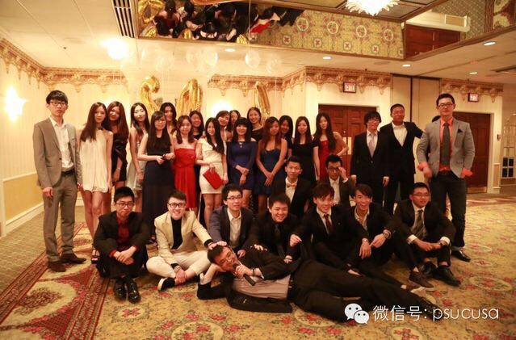
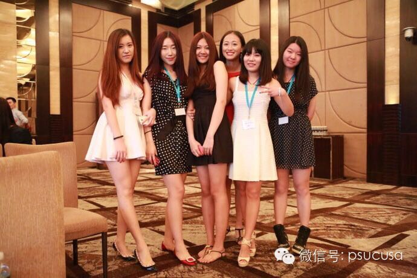
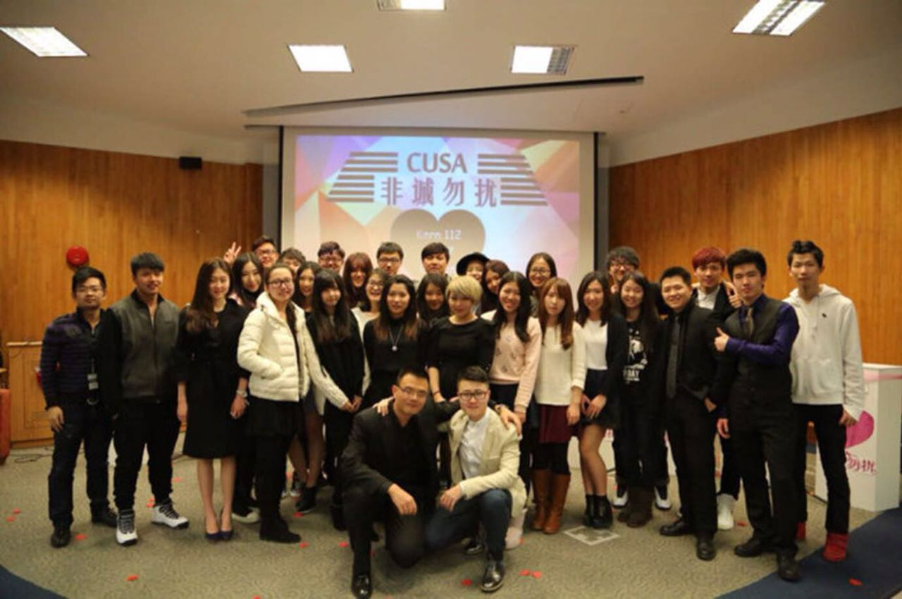
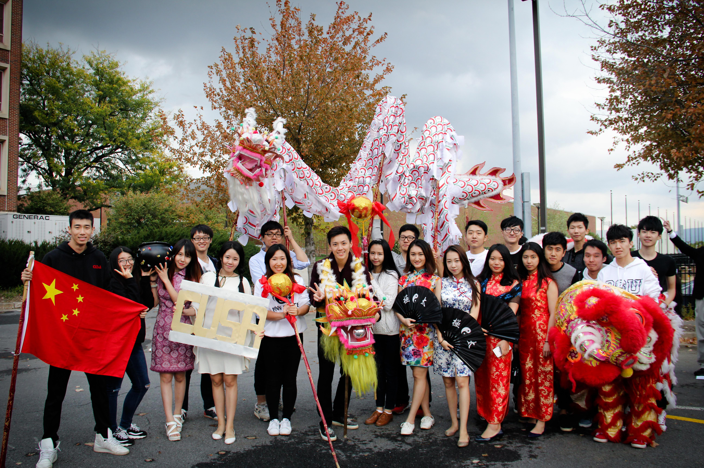
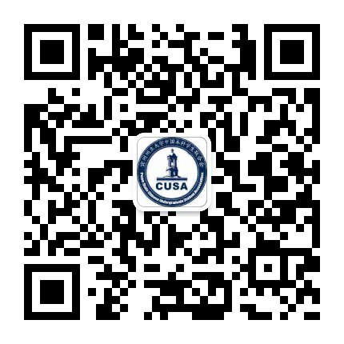

# 结尾篇

## 学长学姐寄语

**先睡觉吧**：希望你们在 Penn State勿忘初心，向阳生长。学一门自己喜欢的专业，做自己最开心的事。

**佛系少女Jo**：希望学弟学妹们在大学 work hard, play hard！自在随心平安喜乐❤

**路路斯**：希望在Penn State的你们听从内心，尊重梦想，有所追求，有所行动，珍惜眼前人，做好身边事。

**Jason**：大学很有可能是你最后一次有机会按照自己的喜好去随便选择自己想学的东西去学习，特别是在PSU这种大学校，选择多到眼花。所以一定要把握好这个机会，勇敢地在知识的海洋里探索吧～～

**Mika**：大学四年会是你过的最快最美好最自由的时光……初次告别家庭、踏入社会，学会真正把握住自己、找准自己的方向，是每个人都会面临的挑战。

**阿祖**：唉，祝学弟学妹们在Penn State都能有所收获，大学的生活丰富而多彩，愿你们永不迷失本心，都能成长为更优秀的自己。

**覃沛森**：大学四年的时间看似很长，却又转瞬即逝，希望大家能珍惜这四年的时光，立下一个目标，四年过后希望能不忘初心，给自己一个满意答复。祝大家找到最适合自己的组织！（PS：比如CUSA）

**戴维**：上课抢前排，无论是语言上的问题还是课业内容上的问题听不懂就问，借口就是自己不是本地人英语不熟（无论你是不是真的不熟）。问问题时要直截了当，先把问题甩出来，再接着细细把你问这个问题的缘由和你具体想要什么样的答案说出来。杜绝有意识翘课、迟到（死在床上另当别论）。认真完成每一次课业任务，看见大腿就抱，不论白的黄的还是黑的，不懂就向大腿问。不知道是不是大腿的也先抱了再说，发现不是大腿不要跑，让对方抱你大腿，说不定以后在别的地方能帮上忙。让别人抱大腿，在自己巩固温习所学知识、技能的同时，又能推动关系网的建立，还能提升自己在他人心目中的印象分。

**束放**：大学生活要social一点，别整天宅在宿舍里不舍得电脑里的一些东西~实习不好找，所以要跟专业里比较牛逼的professor搞好关系，找机会去他手底下做research~周五晚上少去些酒局club或者轰趴，多来参加有益于身心发展的活动，比如满是套路的狼人局~最后就是学弟们要多来找学姐们玩，把学妹们留给学长们，形成一个良性循环。

## CUSA历届温情合照

## 致新生

你们怀着新的喜悦、揣着新的憧憬，带着新的追求，满怀梦想踏上了——－美国，这个用无数梦想堆积成的国度。在这里，没有了翘首以盼的家人，没有了亲切熟悉的环境，没有了肤色单一的人群。相继而来的是激烈的竞争，巨大的压力，以及多元化的挑战。在这里，你第一件需要学习的事情就是“生存”。在美国的四年大学生活，既可以让你感到安逸舒适，也可以让你感到心里交瘁，又可以令你放飞梦想。选择的神圣权利在大家自己的手上。时刻保持初心，迎接苦难与挑战，未来的大门会在不久的将来等待着大家的到来。放下包袱，张开双手，准备好去迎接人生中最深刻的四年大学生活吧！谨以此代表宾西法尼州立大学本科学生联合会欢迎各位新生的到来！

## CUSA联系方式

CUSA 微信公众号：psucusa  
 CUSA 官方主页：[https://www.psucusa.com/](https://www.psucusa.com/)  
 CUSA 新浪微博：[http://weibo.com/psucusa ](http://weibo.com/psucusa%20)  
 CUSA Facebook: [http://facebook.com/cusa.pennstate ](http://facebook.com/cusa.pennstate)  
 CUSA 官方Instagram: [psu\_cusa ](https://www.instagram.com/psu_cusa/?hl=en)  
 CUSA 官方邮箱：psu.cusa@gmail.com

