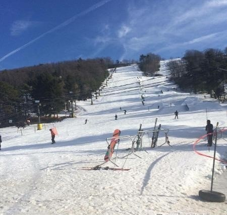
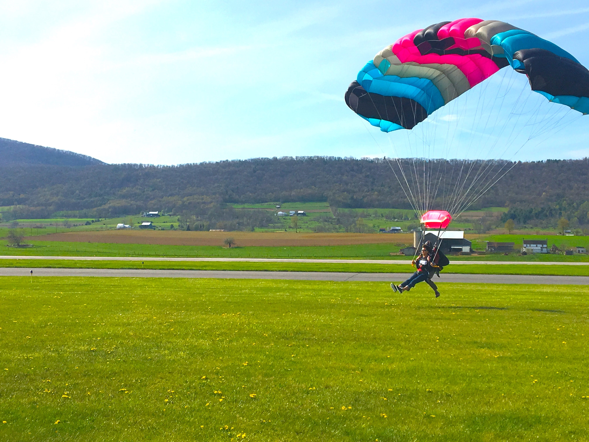
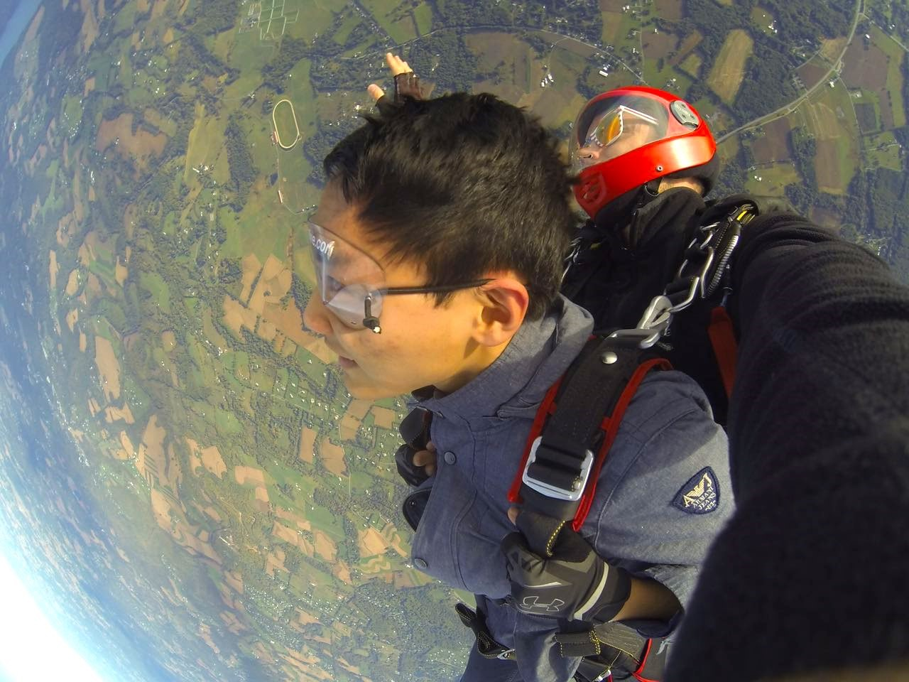
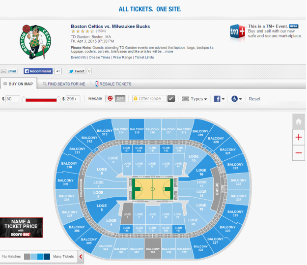
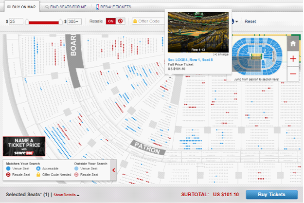
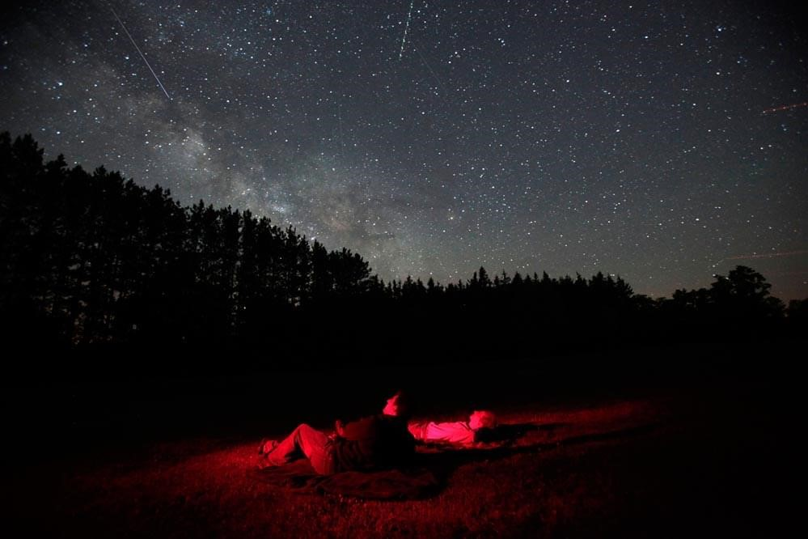

# 校外娱乐篇

## University Park 周边

  在State College周边有许多假期的好去处。虽然学校的地理位置相对比较偏僻，但是周边的大城市还是可以让大家尽兴的。从纽约出发，可以乘坐沿线的火车到达许多个城市，也不失为一种享受。下面我们就通过几个方面的介绍,来了解学校周边的这些城市吧~

### Philadelphia

  费城，美国的第五大城市。满满的都是历史文化，开国之初的首都。 距离State College车程在 4 个小时左右，学校的学生可以乘坐 Mega Bus 途径 Harrisburg 来到这个位于特拉华河畔的美丽城市。这个极具美食与购物的城市，也同样拥有旅行的乐趣。

* 交通
  * 小编推荐: 地铁:月票（Monthly Pass）78美元/人，周票（Weekly Pass）20.75美元/人；一日票（Day Pass）6美元/人，若超过区域，还是要加付越区费。这种通票只限购买者使用，地铁和巴士通用。
* 一日游线路
  * 上午
    * 从费城的市政厅出发\(极具特色的市政厅在感恩节之后就会搭建起溜冰场\)，参观周边的博爱公园，以及富兰克林大道。步行前往独立钟和独立厅（值得一试的是乘坐马车游览独立亭周围的居民区，这里是费城上流社会的聚集地~）
  * 中午
    * 可以前往距离市中心不到20分钟路程的雷丁集贸市场（好吃的冰淇淋和糖果在这里应有尽有,也一定要品尝正宗的Philadelphia Steak~）位于八街的中国城也会是另一个好的选择。
  * 下午
    * 可以前往UPenn，学校具有自己的校史博物馆和特色礼品店。最值得推荐的就是学校住宿区的建筑，以及随处可见的教堂。另外，学商的小伙伴们也可以抽空去探索一下享誉全球的Wharton Business School。
  * 黄昏
    * 这些景点都走遍之后，就可以回到Walnut Street，满满都是各个品牌的Boutique，是爱shopping的女生的绝佳去处。而对于男生来说，这里的美食也是一家比一家更吸引人。
* 两日游线路
  * 在第一天的基础上，CUSA 要强烈推荐费城当地的美术馆，热爱美术的小伙伴可以利用一个周末的时间，参观费城艺术博物馆 \(Philadelphia Museum of Art\)，营业时间为周二到周日的上午十点至下午五点，普通成人票为20元。参观完博物馆，也可以考虑将老城区加入行程单，当地无数特色酒吧的聚集地。特色的冰淇淋店 Franklin Ice-cream 也值得一试，多种口味，小小的店铺。

### Pittsburgh

  买车的第一个周末想要浪，但又害怕长途，那么就强烈推荐Pittsburgh这个城市。虽然整体感觉有些脏乱，但是还是很值得一探究竟的。乘坐Megabus或者开车的话都是两个小时左右到。如费城一样也是一个周末就能完成。

* 公交：市内的工交系统相对发达，但是要时时注意谷歌地图。
* 一日游线路



{% tab title="上午"}
从匹兹堡市中心附近的酒店出发前往匹兹堡大学和卡耐基梅隆大学。两所大学相隔很近。相对来说身为基督教学校的匹兹堡大学更富有历史气息。而卡耐基梅隆可能就更加的科技化了。值得一提的提的是，匹兹堡大学拥有一座著名建筑叫做 Cathedral of Learning. 十分歌特风。


{% tab title="中午"}
在大学城附近的餐厅就餐，和State College周边一样也有许多的中国餐厅。


{% tab title="下午"}
前往市中心的PNC广场。市中心也同样可以满足许多的购物需求。


{% tab title="晚上"}
匹兹堡的夜景堪称一绝，也是全美十大夜景之一。乘缆车登上 The Duquesne Incline。就可以远眺美美的夜景了。（最好在傍晚时分登上山～）




* 两日游线路
  * 第二天的早上就可以前往匹兹堡的 strip 区，十分拥有历史文化特色。各色的食品店，礼品店等等应有尽有。赶个大早，去感受不同的城市文化
  * 小编推荐：匹兹堡周边的奥特莱斯也十分有名。特别大的是 Tanger Outlets 和 Grove City 可以利用回程的路好好再享受购物一番。

### New York City

  美国第一大城市，从 State College 乘坐五个小时左右的车就能到达纽约。着实，纽约需要花时间来细细品味，慢慢咀嚼其中的美。下面介绍的路线更具不同的人来分。

* 一日经典路线: 自由女神，华尔街，中央公园，大都会艺术博物馆，帝国大厦。



{% tab title="上午"}
自由女神。自由女神的门票需要提前在官网上订好，直接去是无法上岛的只能远眺。其位于曼哈顿下城区，金融贸易区附近。另外有一条线路是乘坐游船环绕曼哈顿岛。另外华尔街就在几条街之外，步行就能到达。乘此机会也能远眺布鲁克林大桥。


{% tab title="中午"}
可以乘坐地铁前往中央公园。至于午餐就可以在第五大道上面解决，拥有无数大牌专卖店的第五大道也是邂逅明星的好地方。午餐后可以在偌大的中央公园里小憩。也可以前往大都会博物馆参观。（注意，喜好艺术的宝宝们，大都会博物馆并不是一天就能看完的，只能走马观花，如果想细细品味可以另外安排一天。）


{% tab title="傍晚"}
可以前往帝国大厦欣赏纽约的夜景。这个也是老牌的经典游客线路了。




* 一日游时尚达人线路：SOHO Ktown 第五大道
  * 聚集一种一线潮牌的soho绝对可以满足时尚人士的敏锐触角。 Acne Studio, Stussy. Aape 等等都在 SOHO区设有专门的 Boutique.
  * Ktown：虽然小却十分有特色。值得强推的就是位于这里的姜虎东烤肉。喜欢韩国文化的宝宝们可以到这里过过瘾。

#### NYC 餐厅

  纽约的美食也值得细细品尝.以下为五家被评为米其林三星的纽约餐厅.



{% tab title="Chef’s Table"}
[431 W 37th St, New York, NY 10018](https://www.google.com/maps/place/Chef's+Table+at+Brooklyn+Fare/@40.7561943,-74.0227197,13z/data=!4m8!1m2!2m1!1sChef's+Table!3m4!1s0x89c25a4d00525589:0xa0ddf3ff54eadbcd!8m2!3d40.7561187!4d-73.996455)

只有18个位置，开放式的厨房，记得要提前6周预定。菜单则每天都在变化，难以预知。


{% tab title="Eleven Madison Park"}
[11 Madison Ave \(at E 24th St\), New York, NY 10010](https://www.google.com/maps/place/Eleven+Madison+Park/@40.7415114,-73.9869677,15z/data=!4m2!3m1!1s0x0:0x5654dfd3ae8aa92c?sa=X&ved=2ahUKEwjkiPCq88jhAhUNn-AKHbMPDb4Q_BIwE3oECAkQCA)

同样没有菜单，只有一张写着今日食材的卡片，可以将不喜欢的食材划去。留下喜欢的让厨师自行发挥。套餐为225美金。


{% tab title="Jean-Georges"}
[1 Central Park West, New York, NY 10023](https://www.google.com/maps/place/Jean-Georges/@40.7690691,-73.9815601,15z/data=!4m5!3m4!1s0x0:0xb62f2ce924aab247!8m2!3d40.7690691!4d-73.9815601)

新派法餐的代表。结合了亚洲料理和法国料理。也提供套餐，价格由128-238美金不等。


{% tab title="Masa"}
[10 Columbus Cir, New York, NY 10019](https://www.google.com/maps/place/Masa/@40.7685729,-73.9830453,15z/data=!4m5!3m4!1s0x0:0x20b8803f17d787e0!8m2!3d40.7685729!4d-73.9830453)

纽约唯一一家日食料理米其林餐厅，也是全世界最昂贵的餐厅之一。人均450美金。


{% tab title="Per Se"}
[10 Columbus Cir, New York, NY 10019](https://www.google.com/maps/place/Per+Se/@40.7682407,-73.9829029,15z/data=!4m5!3m4!1s0x0:0x5e24118dffac8a65!8m2!3d40.7682407!4d-73.9829029)

被誉为纽约最佳餐厅，在里面即刻享受味觉的盛宴。




### Boston

  Harford, MIT, Boston College, Boston University, North Eastern University等等，拥有众多名校。这座大学城当然不容小觑，值得一去。由于波士顿景点相对分散，以下给大家介绍三日紧凑的旅游路线。

* Day 1
  * 前往哈佛大学和麻省理工.徜徉在这两所世界知名学府里，也有一种学术上身的感觉.学校周边的咖啡厅也值得一去~花上半天的时间，在这两所名校里走走逛逛，十分值得。
  * 傍晚时分可以前往位于市中心的 Prudential Center。近距离临略这个城市，值得一提的是，由于波士顿处于新英格兰地区，因此所有的建筑排列都十分整齐，很有韵味。
* Day 2
  * 早上可以前往水族馆参观，波士顿水族馆十分有特色。中午则可以尝试波士顿闻名遐迩的大龙虾。下午即刻前往昆西市场，慢慢的都是美食和正能量。
* Day 3
  * 小编推荐可以出发去看海，或者可以前往远离闹市中心的 Boston College 看一看，也可以在市中心的商圈逛街购物。

## 其他旅游城市

### Washington DC

> 真正的纸牌屋

  华盛顿隶属于哥伦比亚特区，也是美国的政治中心。从林肯中心到国会山的一线景色相对来说是最好的。值得一提的是，《博物馆奇妙夜2》就是在华盛顿拍摄，因为华盛顿作为首都区域，博物馆多而精。喜欢走走逛逛的宝宝们最适合了。3月为华盛顿地区的樱花季，赏樱也成为了一种流行趋势（不过强烈推荐非周末时间去，周末人流相对多。）

### Baltimore

> 近在咫尺的海港

  如果想拥有一天的美好时光，完全可以尝试巴尔的摩。这个城市临近海湾，十分有特色。巴尔的摩拥有一个国家水族馆，拥有巨大的水池水柜。另外，作为五大湖地区唯一的入海口，巴尔的摩海港停泊的船只也十分多。海鲜更是一绝。 芝加哥：不再只是中转站。

### Chicago

> 不再只是中转站

  芝加哥的好数不胜数，表面虽然钢筋水泥，但实质上，却是一个充斥着文化的地方。来芝加哥，Wills Tower已经成为必须要去的经典，临空400米左右可以俯瞰整个城市的星星点点。另外云门也是必去景点，在水银一般的“豆子”雕塑下面合影，也算是达成了成就。芝加哥也是个博物馆众多的城市。各种有特色的博物馆应有尽有。

## Altoona & 娱乐

  Altoona 中文名为阿尔图纳，距离 State College 约 45 miles，驾驶时间约50分钟。Penn State Altoona 创立于1939年，现学生人数在 Penn State 所有校区排名第三。阿尔图纳建立于1849年，至1895年，阿尔图纳成为美国最主要的铁路运输城市。除铁路运输外，美国南北战争时期，美国第16任总统林肯与12位政治家聚首阿尔图纳商讨南北战争的重要事宜。

### Altoona Railroaders Memorial Museum

  阿尔图纳铁路工纪念博物馆

* [1200 9th Ave, Altoona, PA 16602](https://www.google.com/maps/place/Railroaders+Memorial+Museum/@40.513957,-78.39935,15z/data=!4m5!3m4!1s0x0:0x8cad2fff386737ab!8m2!3d40.513957!4d-78.39935)
* 9:00 AM - 5:00 PM

### Tilt Studio \(Arcade & Laser tag room\)

  室内电玩场与镭射室

* [5580 Goods Ln, Altoona, PA 16602](https://www.google.com/maps/place/Tilt+Studio+Logan+Valley/@40.4695595,-78.4111047,15z/data=!4m5!3m4!1s0x0:0x8ee053dea508005e!8m2!3d40.4695595!4d-78.4111047)
* 10:00 AM - 10:00 PM

### Altoona Indoor Range

  阿尔图纳室内射击场（枪支与射箭）

* [704 8th Ave, Altoona, PA 16602](https://www.google.com/maps/place/Outdoor+City+%26+Altoona+Indoor+Ranges/@40.5178591,-78.3943423,15z/data=!4m5!3m4!1s0x0:0xba8eb2a7a84f83e2!8m2!3d40.5178591!4d-78.3943423)
* 营业时间不定，建议提前致电 \(814\)201-2959

### Horseshoe Curve

  阿尔图纳国家景点

* [2400 Veterans Memorial Hwy, Altoona, PA 16601](https://www.google.com/maps/place/Horseshoe+Curve+NHL/@40.4977514,-78.4850179,15z/data=!4m5!3m4!1s0x0:0x5cbcfc82f751d88!8m2!3d40.4977514!4d-78.4850179)
* \(814\)941-2540

### Lakemont Park

  建立于1894年，现仍保留着世界上历史最悠久的过山车 “Leap-The-Dips”

* [700 Park Ave, Altoona, PA 16602](https://www.google.com/maps/place/Lakemont+Park/@40.471383,-78.395828,15z/data=!4m5!3m4!1s0x0:0x9e833df44d247092!8m2!3d40.471383!4d-78.395828)
* \(814\)949-7275

## 游乐场

### Hershey Park

  在宾州必须要去的游乐园没有之一。距离 PSU 校区最近的游乐场，距离 Park 校区车程2小时左右；距离 Harrisburg 分校车程仅有20分钟。整个园主要区分为 Hershey Park, ZooAmerica, 以及 Hershey’s Chocolate World。其中在 Hershey Park 内有13种过山车以及水上乐园项目可供选择。同时在每年的万圣节和圣诞节 Hershey Park 都会有特别的节日活动和不一样的节日装扮，推荐大家一定要去体验。最后，建议大家最好组队去玩，选择包车的话也更加划算。

[100 Hersheypark Dr, Hershey, PA 17033](https://www.google.com/maps/place/Hersheypark/@40.2887809,-76.6547469,15z/data=!4m5!3m4!1s0x0:0x9f0f173cf15fad64!8m2!3d40.2887809!4d-76.6547469)

### Six Flags

  北美最有名的过山车游乐园，其中在美国一共有16个园区，今天推荐大家去的是距离 PSU距离最近的 Six Flags in Bowie, MD。该园区距离 PSU Park 校区车程大约3个半小时，园区内有数不清的过山车，水上项目以及娱乐活动！同时在节日期间，乐园会有特别活动。建议大家出发前提前安排并去网站查找信息，对于有车的小伙伴提前买票的同时别忘记买停车位！

[13710 Central Ave, Bowie, MD 20721](https://www.google.com/maps/place/Six+Flags+America/@38.9486275,-76.6281664,11.13z/data=!4m5!3m4!1s0x0:0xc966c337bc741434!8m2!3d38.9074672!4d-76.7744897)

### Cedar Point

  相对 于Hershey Park 和 Six Flags 来说, Cedar Point距离 PSU Park校区较远，车程大概5个小时左右。同样，Cedar Point 也是以过山车和水上乐园为主的游乐园。对于玩腻 Hershey Park和 Six Flags的同学来说，Cedar Point可以作为一个新的选择。

[1 Cedar Point Dr, Sandusky, OH 44870](https://www.google.com/maps/place/Cedar+Point/@41.482207,-82.6835206,15z/data=!4m5!3m4!1s0x0:0xae0d3d15735875a7!8m2!3d41.482207!4d-82.6835206)

## 彩弹射击

### Eagle valley paintball

  对于喜欢和想尝试彩蛋射击的同学来说 Eagle Valley Paintball 是最好的选择。该射击场是整个 State College 唯一的彩蛋射击场，距离 Psu Park校区车程30分钟左右。建议大家组队去玩并提前预约。

* 预约电话：\(814\)327-2425
* [14205 S Eagle Valley Rd, Tyrone, PA 16686](https://www.google.com/maps/place/Eagle+Valley+Paintball/@40.7061913,-78.2105861,15z/data=!4m5!3m4!1s0x0:0x4367be896f4c0326!8m2!3d40.7061913!4d-78.2105861)

### 滑雪

  进入冬天后滑雪会成为大家首选的室外娱乐活动，离学校最近的滑雪场为 Tussey Mountain，仅距 8 miles，开车15-20分钟就能到达，也可以做公交B线约1小时到达。

  开放时间大约在12月中旬至3月，视气候而定，营业时间为周一至周五12:00 PM-10:00 PM，周六9:00 AM-10:00 PM，周日9:00 AM - 5:00 PM。出发前建议穿好保暖衣物，裤子最好为防水型。到达滑雪场后买票，单人全天票价为 $38-$46，视具体时间而定。滑雪板，头盔，滑雪服，手套和护目镜等都可在滑雪场的商店购买或者租赁，可根据自己滑雪的频率决定购买还是租赁。建议备好保暖手套，如遇滑雪场正在造雪则需护目镜。滑雪场提供单板和双板滑雪板，单板难度较大，建议新手优先选择双板。滑雪场内分新手区和高手区，且都配有缆车上下，新手区较为平坦，初次滑雪可以先在新手区练习。

### 跳伞

  跳伞流程介绍：从10000英尺的高空中从飞机里跳出， 自由落体姿势以100+mph的速度直冲地面（越持续30秒）。到达约3000英尺的高度时，伞包将会打开，以满满的享受4-5分钟高空美景。（独自跳伞需要USPA跳伞资格证）


注意事项：Tandem Jump 需求年龄18岁以上，体重不得超过235磅。跳伞当天要穿舒适服装（建议长袖）不得穿凉鞋或拖鞋。有心脏病史，精神疾病，哮喘等病史不建议参见


**地点：** Skydive Happy Valley \([540 Airport Rd, Reedsville, PA 17084](https://www.google.com/maps/place/Skydive+Happy+Valley/@40.6776324,-77.6232241,15z/data=!4m5!3m4!1s0x0:0x2882519b5b079efe!8m2!3d40.6776324!4d-77.6232241)\)

**跳伞种类**

* Tandem Jump（$215含押金）不需要学习，有一个教练会把你绑在他的身上一起从10000英尺降落，会有30秒左右的自由落体，然后4－5分钟的滑行。不能自己录像，可以花钱请别人帮你在空中录像
* IAD \(Instructor Aided Deployment Training\) 价格为$200（含押金）是为打算考 USPA跳伞证的人准备的。 A级跳伞需要跳满25次。第一次需要提前上一个2-3小时的指导课。第一次跳伞为4000英尺起跳 想拍照求刺激的同学注请注意 此跳伞没有自由落体过程，教练会无线电指导，全程自己降落。

### NBA

  很多同学说来到美帝之后终于可以看 NBA Live，陪伴我们长大的那一代老兵最后的演出，只要他们还在场上打着球，就是一种幸福。不论你能说得天花乱缀，现在，以往屏幕上的球队活生生的就在眼前。赶紧来看一下怎么订票吧。其实很简单，nbatickets.com或者直接 ticketmaster 一个网站轻轻松松搞定一切。选好想要观看的场次后，就进入了球馆座位分布的界面。以波士顿凯尔特人主场为例，最好的位置当然是球场旁边经常有名流出没的 FLOOR level, 如果没有那么壕，两队替补席位或者技术台后面（图中 LOGE 2,1,22,13,12,11）也是很好的选择。若是追求经济实惠又能有不错的观赛体验，球场正面两侧上层看台（BALCONY 302,301,330,317,316,315）最合适不过了。如果你比较机智，强烈推荐球员通道两侧的LOGE 4,3,21,20，有人可是和球星击好掌一整天不舍得洗手呢。

知道了自己的看台就可以点进去啦，蓝色代表 Available，灰色 Unavailable，红色 Resale是其他观众可能去不了出售的票。鼠标移过去，可以看到每个座位的具体信息以及价格。选定之后图标会变成黑色，付完款后别忘了把球票打印出来，就可以享受 NBA Live啦。

如果没有提前网上订票也没有关系，比赛当晚球馆周围你总能发现黄牛在转悠，这点倒是各地都一样。另外就在我们 PSU Nittany Lions 也常有 BIG10 大学联赛，学生票只要$5， free t-shirts 让整个 BJC 恍然也有种 NBA 的即视感呢。

### 看星星

  宾夕法尼亚樱桃泉国家公园（Cherry Springs State Park, Pennsylvania）是宾夕法尼亚州20大必游景点之一，被誉为“美国东海岸最黑的夜空”，也是离学校最近和最佳的星空观测公园，距学校约95.8mile，开车约2小时到达。建议前往之前先看下天气预报，挑选晴朗无云的一天晚上去。 因为海拔较高，气温很低，最好多带几件防寒的衣物。如果你会摄影的话不要忘了带上你的相机，操作正确可以拍下很美的星空照片。晚上开上山之后路会非常黑，建议与多人同行，小心驾驶。到达停车场之后观测平台在停车场的边上，是一大片草坪，有红色路标指引，因为观测平台非常黑，但是建议不要用手电筒或者手机等打光，这样会影响他人的观赏体验。选择一处位置就可以观赏星空了，你可以下载一些星座的APP来与天上各个星座对应，甚至用肉眼就能看到整一条银河。因为观赏平台没有信号而且非常黑，建议不要走得离同伴太远。

地址: [4639 Cherry Springs Rd, Coudersport, PA 16915](https://www.google.com/maps/place/Cherry+Springs+State+Park/@41.6656062,-77.8280371,15z/data=!4m5!3m4!1s0x0:0x65b78dbe76d60fca!8m2!3d41.6656062!4d-77.8280371)

