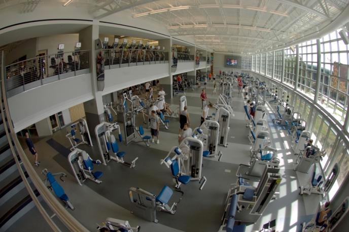
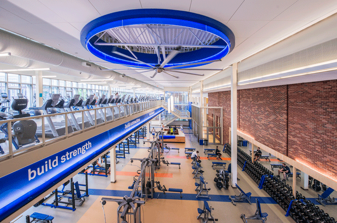
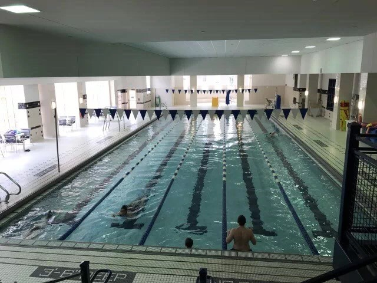
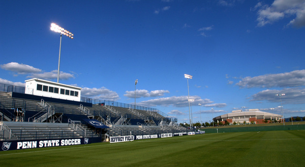
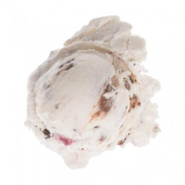
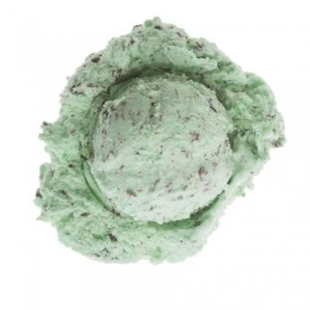
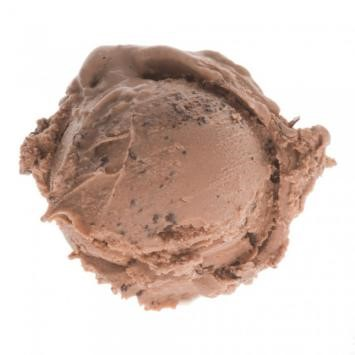
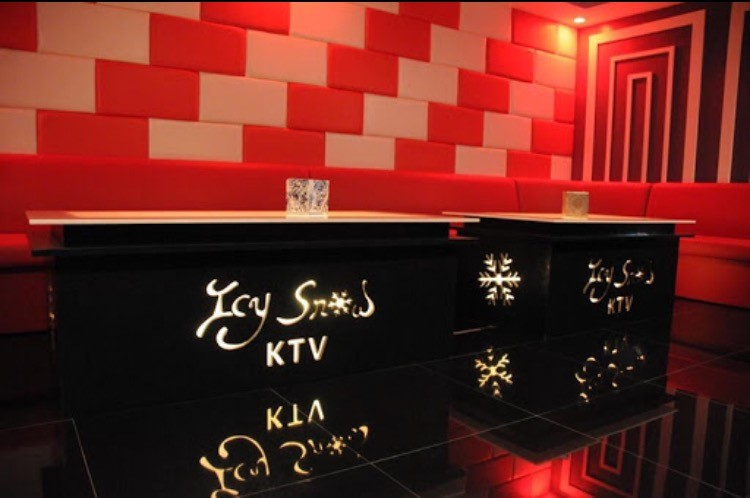
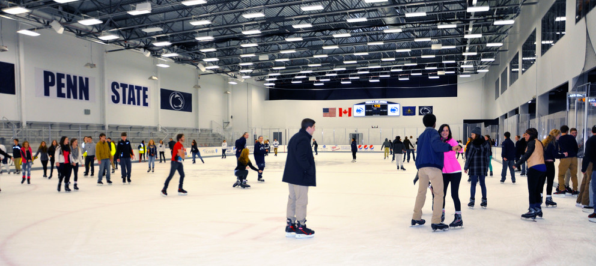
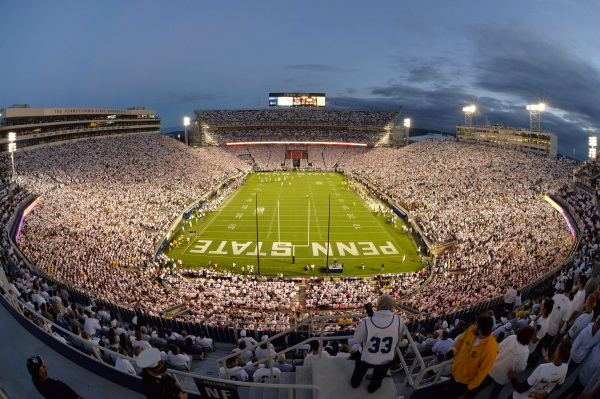

# 校内娱乐篇

## 校内体育介绍及场馆分布
### Rec Hall Fitness Center
&emsp;&emsp;Rec Hall Fitness Center 位于 West Residence Halls 附近。相比于前两个体育馆，Hepper 的功能也就仅限于健身了，健身器材自然一应俱全。分为上下两层，一层为自由力量训练，而二楼自然是器械训练，主要以跑步机为主。 Hepper 光线明亮，最最重要的是，距离 downtown 超级近，同学们可以在健身之后，去 downtown 美餐一顿，或者罪恶地买杯奶茶犒劳下自己，嘿嘿。

### IM Building
&emsp;&emsp;IM Building 应该是Park功能最齐全的体育馆了，包含篮球、排球、羽毛球、室内足球、冰球、以及攀岩等各种体育活动，唯一遗憾的是没有游泳池。IM Building 还有一条全长266米的跑道，厌倦了跑步机，觉得跑步机不够自然？在 IM，同学们可以在跑道上自由奔跑，根据自己的情况随时改变速度，再也不用一下一下的按键调节啦。IM的设施也是一应俱全，灯光明亮，场地开阔，在其中运动自然也身心舒畅。如果不是专注于游泳，IM Building应该是同学们运动健身的首选。
但由于场地可能被学校用作其他活动，想使用前最好先问问那边的 faculty。

### White Building
&emsp;&emsp;White Building 最大的优势在于有一个室内游泳池，而且距离 Hub 是最近的，两节课之间时间跨度有些大，不知道该干什么？那就来 White Building 运动放松吧。 White Building 虽然没有IM的功能那么齐全，不过倒也能满足大家日常的体育运动，羽毛球或者篮球的设施都有，相比于 IM ，健身区就相对小了些，光线也没有那么明亮。对于各个社团来说，White 宽敞的篮球场也可以用来举行大型活动，不过要提前预约哟。

### 足球场
&emsp;&emsp;在 IST building 和 White course apartments 中间有一大块足球场，基本上使用是完全自由的，只要没有学校球队練习就可使用。那边踢球的大部分是拉丁人和欧洲人，实力有点强， 上去交谈即可加入。

## 学校冰淇淋
**Berkey Creamery!!!**

**Berkey Creamery!!!**

**Berkey Creamery!!!**

(重要的事情说三遍)

&emsp;&emsp;1896年以来宾夕法尼亚州立大学就获得了牛奶冰淇淋大学乳品的传统。这美味的冰淇淋，与乳汁含量为 14.1%，只有最好的成分新鲜牛奶和奶油。 Berkey Creamery 是宾州州立大学校内的一所甜点雪糕店。学校 Food Science Department 独特配方生产出来的雪糕在全美也是远近驰名，一百五十年悠久历史的老口碑雪糕店。每年约可以卖到 **250万份** 的甜筒雪糕。

&emsp;&emsp;学校最出名的美食就是冰淇淋—— 往往在周末的时候，旅客们来 State College 周边城市旅游的话 Berkey Creamery 也是一个必来的景点。 每个来小镇看参观学校和看学校橄榄球运动的人都会排队去买学校食品学院自产的冰淇淋，每次一旦一有橄榄球比赛的时候，都能看见四十多米以上的长队。

&emsp;&emsp;Penn State Berkey Creamery 是 PSU 校园内最强冰激凌店，没有之一！每天店中都会有着多达二十种由新鲜食材制作的冰激凌口味供大家选择。而且这二十种口味是每天更新哦！还有一大排冰箱，陈列着PSU自制的牛奶，果汁，冰淇淋等，这些被包装好的美味也是为了大家方便带回家保存品尝哟~
&emsp;&emsp;Berkey 里可以选择 Bowl or Cone，配合着口味丰富的选择和满到溢出的冰淇淋，一定是大家炎炎夏日里的首选去处。熟悉宾州的小伙伴们一定知道，宾州的夏天是多么珍贵，熬过了漫长寒冷的冬季，天气回暖，戴上墨镜，选一种自己最爱的冰激凌，坐在 Berkey 门口的太阳伞下，真真是一种享受。 Berkey 家最大的特色为每一位顾客提供一本专属于自己的 Creamery passport。每买过一种口味的冰激凌，都会在相应的位置得到一枚印章，爱收集的小伙伴们，可以开始咯，看看用多久能收集齐全部的印章。

[宾州最好吃的冰淇淋全美48州可以送货上门!!!](http://creamery.psu.edu/)

**下面就来介绍几样在PSU主推的雪糕口味！**

&#8599;&emsp;Alumni Swirl 香草冰淇淋和瑞士摩卡脆 + 蓝莓

&#8599;&emsp;Bittersweet Mint 薄荷雪糕+ 巧克力脆

&#8599;&emsp;Keeney Beany Chocolate巧克力雪糕+巧克力酱

**网购的问题：** 
&emsp;&emsp;首先是冷藏的问题，基本上所有的雪糕标价都是$6.25 1/2Gal,但是每一个的冷藏箱费用可不小。因为就算顾客只买一桶雪糕，都需要20刀的冷藏包装费，所以介意大家取得更大优惠的方式或许就只能多买一点了。

## Icy Snow Karaoke
&emsp;&emsp;Penn State 除了学术方面在美国大学名列前茅外，Top Party School 的称号也被我们光荣地揽入囊中。除了学校丰富的社团活动外，中国留学生也创造了自己丰富的业余生活。 Icy Snow Karaoke 是广大同学课余时间休闲娱乐的首选。店面位于各国美食餐厅之间，与 Penn State 教学楼一街之隔的黄金地理位置。加入 CUSA Member Card Program 便可全年享受优惠哦！

## 学校附近电影院
* College 9

    * 地址：

      * [3031 Carnegie Dr, State College](https://www.google.com/maps/place/State+College+-+College+9/@40.8102317,-77.9286358,17z/data=!3m1!4b1!4m5!3m4!1s0x89cea7ff3e6946f3:0x6fcfd39e7ec2dbc!8m2!3d40.8102277!4d-77.9264418)

    * 推荐指数：&#11088;&#11088;&#11088;&#11088;

    * 推荐路线：

      1. 从 College Avenue At Allen Street 搭乘W线（To Vally Vista） 经停29站到达 Carnegie Dr At Valley Vista Dr Outbound （$2）

      2. 从 Pattee Library 门口搭乘 Hp 线（To Toftrees） 经停30站到达 N Atherton St At Alexander Construction，再步行0.4 英里 （$2)

* UEC Theatres 12

  * 地址：

    * [125 Premiere Dr, State College](https://www.google.com/maps/place/State+College+-+UEC+Theatres+12/@40.8402903,-77.8010786,15z/data=!4m2!3m1!1s0x0:0x27a68b829980da69?sa=X&ved=2ahUKEwj7x4bikLzhAhUBjVkKHcPODogQ_BIwC3oECA4QCA)

  * 推荐指数：&#11088;&#11088;&#11088;&#11088;

  * 推荐路线：

    * 从 Pattee Library 门口搭乘M线（To Nittany Mall） 经停30站到达 Premiere Dr At UEC 12 Theatre （$2）

## 校内桌球
&emsp;&emsp;The Break Zone, PSU 的游戏室位于 HUB-Robeson Center, 提供桌球，飞镖等游戏
* 桌球和乒乓球每小时收费$5
* 飞镖每小时$3
* 其他游戏每小时$4

**营业时间：**

  * Monday:
    * 1:00 pm - 11:00 pm

  * Tuesday:
    * 1:00 pm - 11:00 pm

  * Wednesday:
    * 1:00 pm - 11:00 pm

  * Thursday:
    * 1:00 pm - 11:00 pm

  * Friday:
    * 1:00 pm - 2:00 am

  * Saturday:
    * 1:00 pm - 2:00 am

  * Sunday:
    * 1:00 pm - 11:00 pm

## 商家分布
**Nittany Mall**

  * 地址: [2901 E College Ave, State College, PA 16801](https://www.google.com/maps/place/Nittany+Mall/@40.8325334,-77.8026617,17z/data=!3m1!4b1!4m5!3m4!1s0x89cea45f3139065b:0xefb45d948f548fdd!8m2!3d40.8325294!4d-77.8004677)
  (乘坐M线可到达)

  * 营业时间:

    * Mon - Sat: 10:00 am - 9:00 pm

    * Sun: 11:00 am - 6:00 pm

内设 J.C.Penney, Sears, Macy 和 Bon-Ton 和一些品牌专卖店，比如 Hollister, Express, VC, Gap 等等。

**Harrisburg Mall**

  * 地址: [3501 Paxton St, Harrisburg, PA 171](https://www.google.com/maps/place/Harrisburg+Mall/@40.2522422,-76.8321334,17z/data=!3m1!4b1!4m5!3m4!1s0x89c8c09ac9e4d341:0xf2005f4d39cbfacd!8m2!3d40.2522381!4d-76.8299394)

  (Mega bus Harrisburg 终点站)

  * 营业时间:

    * Mon - Sat: 10:00 am - 9:00 pm

    * Sun: 12:00 am - 6:00 pm

内设Macy’s，电影院及各各种商品店。

**King of Prussia**

  * 地址: [160 N Gulph Rd, King of Prussia, PA 19406](https://www.google.com/maps/place/King+of+Prussia/@40.1055862,-75.4200527,13z/data=!4m5!3m4!1s0x89c6944ab30b8765:0x21c6a02d866542a5!8m2!3d40.0880028!4d-75.3914239)
  (距离费城半个小时，建议开车去)

  * 营业时间:

    * Mon - Sat: 10:00 am - 9:00 pm

    * Sun: 11:00 am - 6:00 pm

KOP 分为两半，一个叫 COURT， 另一个叫 PLAZA， Macy 和 Bloomingdale's 在 Court, Sears, J.C.Penney, Neiman Marcus 和 Nordstrom 是在 Plaza。在 kop 有400多家店，适合周末去购物游玩。

**Urban Outfitters**

  * 地址: [234 E College Ave, State College, PA](https://www.google.com/maps/place/Urban+Outfitters/@40.796001,-77.859231,15z/data=!4m2!3m1!1s0x0:0x713771aaf33e8afe?sa=X&hl=en&ved=2ahUKEwibsoKdlrzhAhVmuVkKHcb1D2UQ_BIwEnoECA4QCA)

    * 营业时间:

      * Mon - Thu: 10:00 am - 8:00 pm

      * Fri - Sat: 10:00 am - 9:00 pm

      * Sunday: 12:00 am - 7:00 pm

位于学校 downtown，是一家街头品牌集合的连锁店（如 Stussy, Dickies, Adidas Original 等）

## 保龄球
**Northland Bowl & Recreation Center**

  * 地址: [1521 Martin St，State College](https://www.google.com/maps/place/Northland+Bowl+%26+Sports+Center/@40.8055946,-77.8915078,15z/data=!4m2!3m1!1s0x0:0xf7724f2c7271b3a8?sa=X&ved=2ahUKEwiv_f6wmLzhAhXm1FkKHXWpC9EQ_BIwCnoECA8QCA)

  * 电话: (814)-237-1500

  * 推荐路线:

    * 从 College Avenue At Allen Street 搭乘N线 （To Martin Street And Aaron Drive) 经停11站 到达 [1540 Martin Street](https://www.google.com/maps/place/Nittany+Oil+Company,+Inc./@40.8050231,-77.8950764,17z/data=!3m1!4b1!4m5!3m4!1s0x89cea87f7044ea63:0x83b6bab8b3389bc3!8m2!3d40.8050191!4d-77.8928824)（Nittany Oil）

  * 营业时间:

    * Monday - Thursday: 9:00 am - 12:00 am

    * Friday & Saturday: 9:00 am - 3:00 am

    * Sunday: 10:00 am - 12:00 am

## 滑冰场
&emsp;&emsp;Petula Ice Arena  是 Penn State 的一座能够容纳6014人的多用途滑冰馆。 目的是为 Penn State hockey 而建， 在没有比赛的时候，每周有公共开放时间（建议提前查看开放时间）

[Petula Ice Arena 网址](http://pegulaicearena.maxgalaxy.net/Schedule.aspx?ID=1&GUID=a1364037-d8a1-481c-b768-fb8b5a2b4fb6)

门票为 $7.00。 
可以自己租冰鞋 $10 一次 ， 也可以自己带。

## 橄榄球赛季
&emsp;&emsp;宾州州立的橄榄球尤其出名，许多人来了宾州州立数载，都不知校长是谁，但都知道美式足球教练的名字与长相。学校的传奇足球教练乔·帕特诺（Joe Paterno）是美国NCAA最有名的教练之一。 
&emsp;&emsp;该校橄榄球队两次夺得全国联赛冠军，24次捧起各种杯赛的冠军，而且先后五个赛季全胜不败,而宾州州立更是拥有一座可容纳4万6千多人的巨型橄榄球场。


随着每年的八月末，九月初， 一年一度大学橄榄球赛季也隆重开幕，建议提前查看比赛时间提前订票。


## 学校例行活动
### Thon
&emsp;&emsp;[Thon] 是 Penn State IFC/ Panhellenic Dance Marathon 的简称，翻译成中文就是 “宾夕法尼亚州里大学学生以及校友舞蹈马拉松活动。” Thon 是世界上最大的大学学生慈善组织活动，每年的二月的一个周末在宾夕法尼亚州立大学主校区大学公园举行。活动内参与者连续 “不坐下，不睡觉” 跳舞46小时，为患癌症的儿童筹集慈善捐款。至今为止，Thon 已经为儿童癌症患者筹集了超过一亿美金的资金。Thon 不仅仅是一个慈善活动，它更是一种精神，是一种爱的传递。

[Thon]: http://www.thon.org/

### Homecoming
&emsp;&emsp;Homecoming是美国高校以及高中欢迎历届校友返校的传统。系列的庆典活动通常面对在校学生和校友们展开，包含体育赛事，文化演出，花车游行等等形式。

### 花车大游行
&emsp;&emsp;在返校的周末上还有环绕着学校所在小镇的游行活动，大街上能看到学生们自己制作的花车和学校的军乐队。

&emsp;&emsp;宾夕法尼亚州立大学的 Homecoming 是全美最大的学生返校节日之一，其目的是通过让广大师生在整个活动中积极参与，铭记传统，体会作为一个 Penn Stater 的荣誉感。从1920年10月第一次 Homecoming 举办以来，在这93年的时间里，即使 Penn State 历经了名称变更，校园扩建，成长和变迁等等，却依然一直延续着这个光荣传统。在这里，你可以沉浸在庆典的气氛中，游行队伍里有你爱的 Organization，你沉浸在方阵里军哥哥的帅气中，拉拉队的姑娘们旋转跳跃一刻也不停歇，你看着海绵宝宝前滚翻，雪宝变魔术，公主和王子在城堡里 Happy Ever After， 还有巨大的粉红色水泥车开过，接着又被交响乐团的音乐给吸引目光，时而还有从老爷车里想你撒来的糖果。。。。。一切目不暇接的玩意儿每分每秒都在给你一个巨大的 Homecoming Surprise！

### 裸奔
&emsp;&emsp;当前的美国校园裸奔是上世纪70年代中期一系列校园学生运动的延续。当年，崇尚自由，反抗传统与挑战权威成为校园文化的主流，裸奔正是那一时期在校园里蔚然成风，并逐渐发展成一种文化符号，与自由，反叛等相联系。只是到了现在，校园裸奔已经褪去了当年的革命色彩，演变成为学生们面临大考前的一种心理宣泄。

&emsp;&emsp;Mifflin 裸奔是 Penn State 历史中出彩的一笔。每个春季学期期末考试周前的星期天学生们会从学校各个地方赶来裸奔以庆祝第一个学年结束。美国大学主要在期中，期末考前脱光衣服出击，学习压力大，需要由行为上的释放触发心理上的解放，也有各种有意义的理由。
